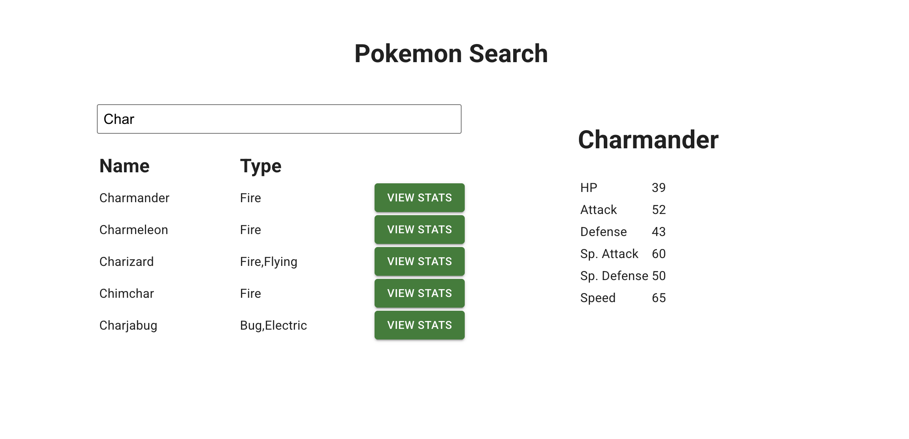

# React MUI crud

**Project:** _Pokemon Search App_   
**Version:** 1.0  
**Author:** Saya Yoshida  
**Date:** [14 Jan 2026]  
**Live Demo:**　https://sayanida.github.io/react-pokemon-search/ 

A simple Pokemon Search application built with **React** and **MUI**.  
You can search pokemon and view the states.

## Screenshot

## Technologies Used
- React
- Material-UI (MUI)
  - Dialog: [MUI Dialog](https://mui.com/material-ui/react-dialog/)
  - Text Field: [MUI TextField](https://mui.com/material-ui/react-text-field/)
  - Buttons: [MUI Button](https://mui.com/material-ui/react-button/)
  - Grid: [MUI DataGrid](https://mui.com/x/react-data-grid/)